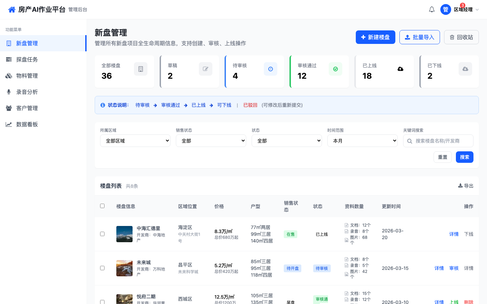
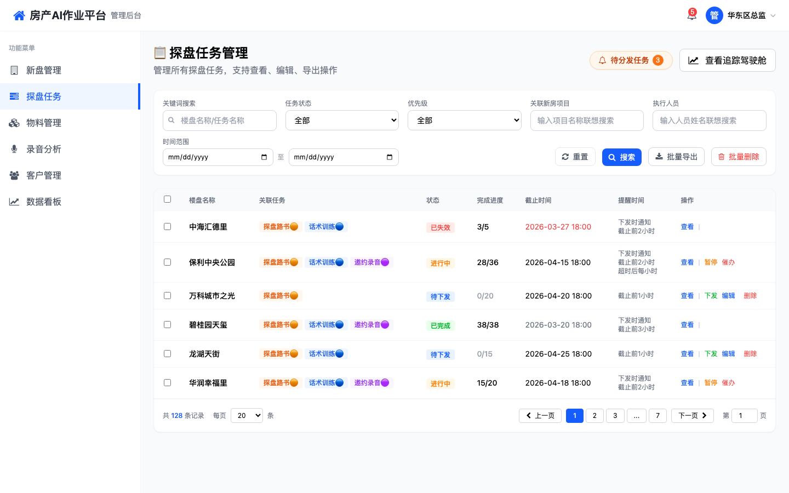
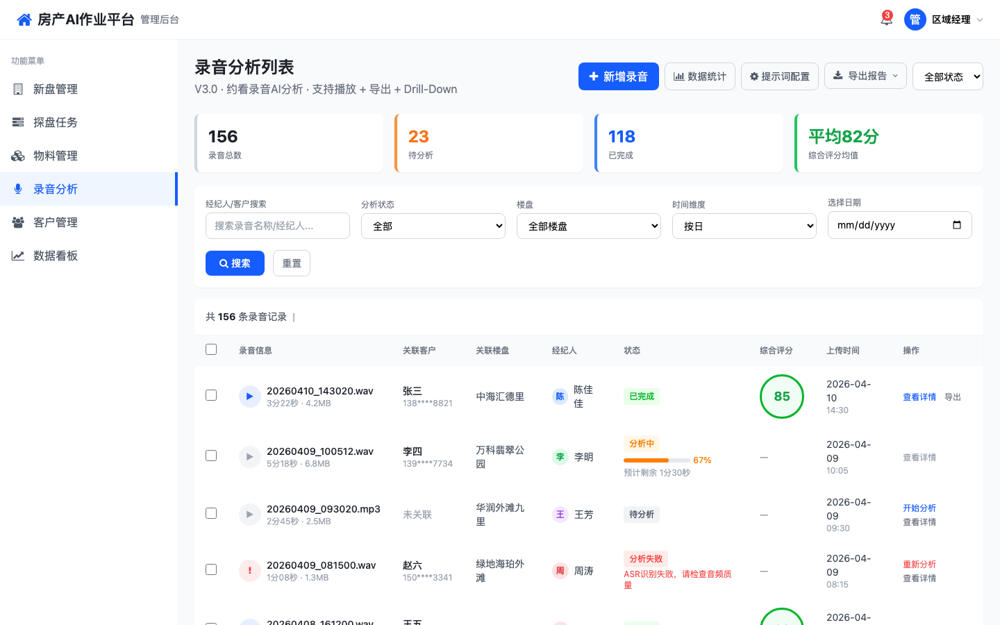
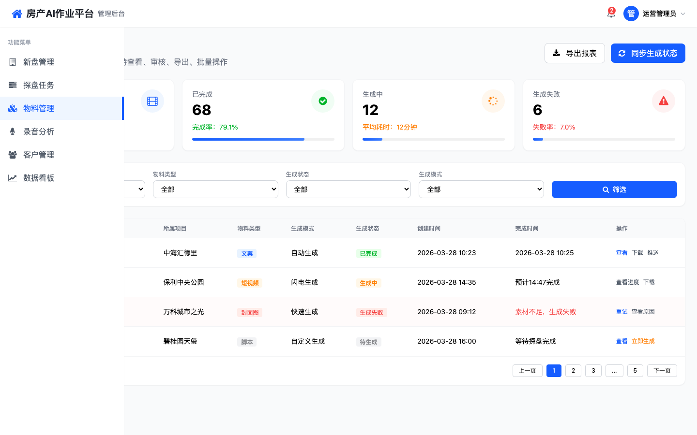
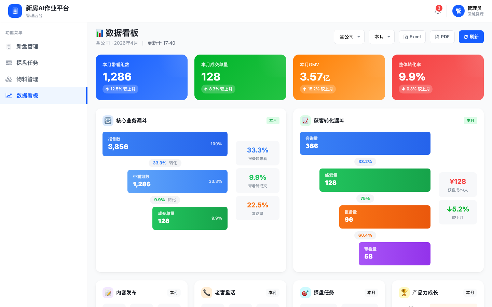
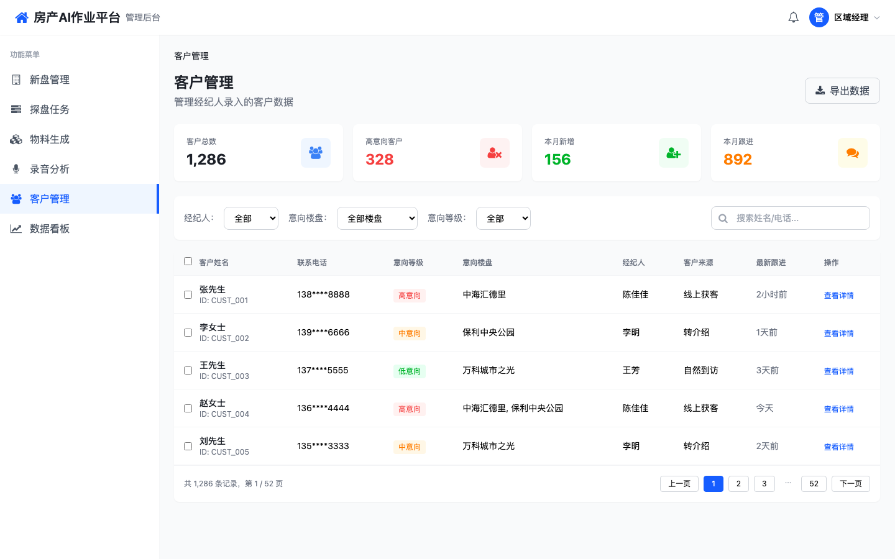
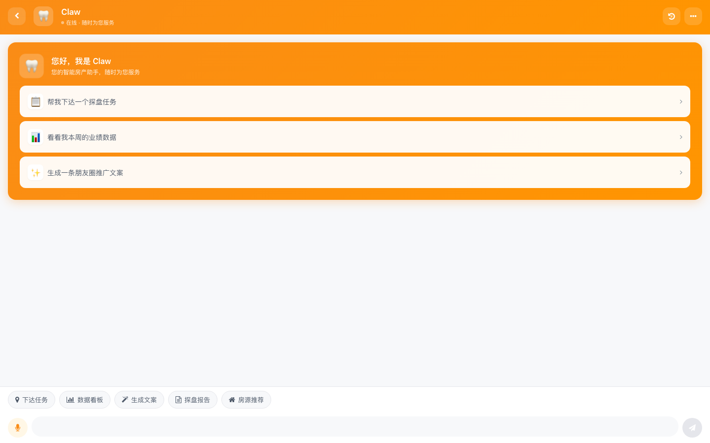
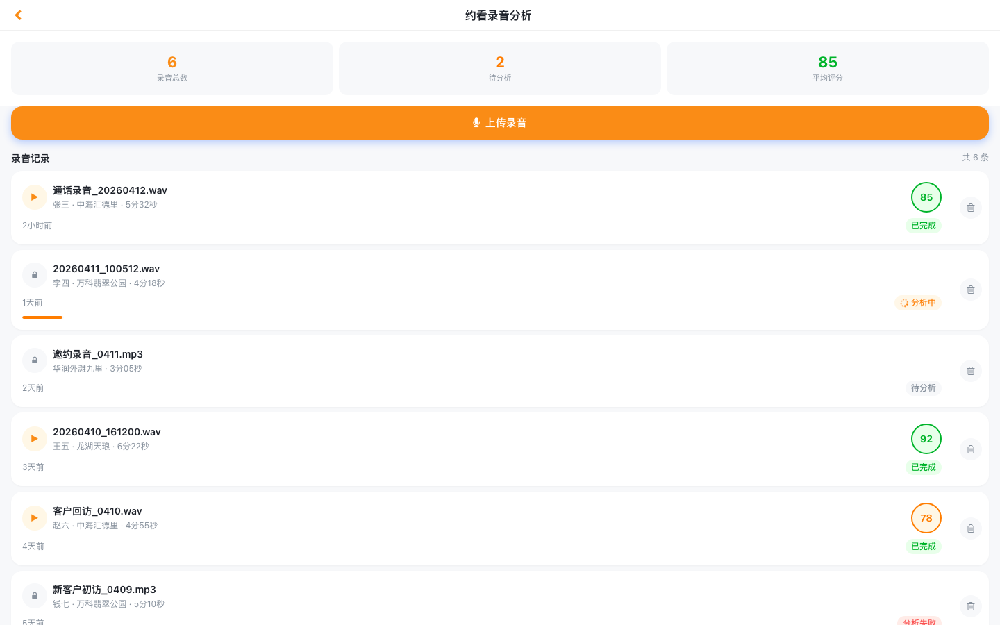
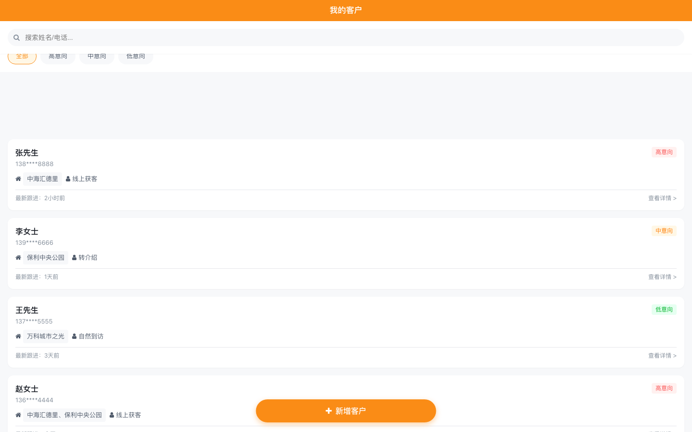

# 新房AI作业平台
## 项目汇报

---

## 📋 项目概述

**新房AI作业平台**是一套面向房产经纪人的智能化作业系统，涵盖从新盘管理、探盘任务、录音分析、物料生成到客户管理的全流程功能。

### 核心价值

| 价值点 | 说明 |
|--------|------|
| 🔄 流程自动化 | AI赋能，自动化生成内容，提升作业效率 |
| 📊 数据可视化 | 实时数据看板，洞察业务状态 |
| 🤖 智能化工具 | AI录音分析、智能物料生成，降低人力成本 |
| 📱 移动端支持 | 小程序随时随地作业，便捷高效 |

---

## 🖥️ PC端功能模块

### 1. 新盘管理

**功能描述**：管理楼盘基础信息，包括项目详情、户型图、周边配套、销讲内容等。

**页面地址**：https://prototypes-ivory-nine.vercel.app/pc/新盘管理/新盘管理-列表-PC.html



---

### 2. 探盘任务

**功能描述**：下发探盘任务，经纪人执行打卡、生成内容、提交报告的全流程管理。

**页面地址**：https://prototypes-ivory-nine.vercel.app/pc/探盘任务/探盘任务-列表.html



---

### 3. 录音分析

**功能描述**：上传经纪人录音，AI自动分析话术质量，生成改进建议。支持多种分析模板配置。

**页面地址**：https://prototypes-ivory-nine.vercel.app/pc/录音分析/录音分析-列表.html



---

### 4. 物料生成管理

**功能描述**：统一管理AI生成的推广物料，包括文案、海报、视频脚本等，支持一键分享。

**页面地址**：https://prototypes-ivory-nine.vercel.app/pc/物料生成管理/物料生成管理-列表-PC.html



---

### 5. 数据看板

**功能描述**：多维度数据统计展示，包括任务完成率、录音分析量、物料使用情况等。

**页面地址**：https://prototypes-ivory-nine.vercel.app/pc/数据看板/数据看板-总览-PC.html



---

### 6. 客户管理 ⭐新增

**功能描述**：管理经纪人录入的客户信息，支持客户筛选、数据导出、跟进记录查看。

**页面地址**：https://prototypes-ivory-nine.vercel.app/pc/客户管理/客户管理-列表.html



---

## 📱 小程序端功能模块

### 1. 首页工作台

**功能描述**：AI助手入口，快速访问各功能模块。

**页面地址**：https://prototypes-ivory-nine.vercel.app/wxapp/home/首页-AI助手.html



---

### 2. 录音分析

**功能描述**：移动端录音上传，实时查看分析结果。

**页面地址**：https://prototypes-ivory-nine.vercel.app/wxapp/录音分析/录音分析-列表.html



---

### 3. 客户管理 ⭐新增

**功能描述**：经纪人移动端客户管理，录入、编辑、跟进客户。

**页面地址**：https://prototypes-ivory-nine.vercel.app/wxapp/客户/客户列表.html



---

## 📊 功能矩阵

| 功能 | PC端 | 小程序端 | 优先级 |
|------|------|----------|--------|
| 新盘管理 | ✅ | ❌ | P0 |
| 探盘任务 | ✅ | ✅ | P0 |
| 录音分析 | ✅ | ✅ | P0 |
| 物料生成 | ✅ | ✅ | P1 |
| 数据看板 | ✅ | ❌ | P1 |
| 客户管理 | ✅ | ✅ | P2 ⭐新增 |

---

## 🔗 完整原型演示地址

### PC端
| 模块 | 地址 |
|------|------|
| 新盘管理 | [点击访问](https://prototypes-ivory-nine.vercel.app/pc/新盘管理/新盘管理-列表-PC.html) |
| 探盘任务 | [点击访问](https://prototypes-ivory-nine.vercel.app/pc/探盘任务/探盘任务-列表.html) |
| 录音分析 | [点击访问](https://prototypes-ivory-nine.vercel.app/pc/录音分析/录音分析-列表.html) |
| 物料生成 | [点击访问](https://prototypes-ivory-nine.vercel.app/pc/物料生成管理/物料生成管理-列表-PC.html) |
| 数据看板 | [点击访问](https://prototypes-ivory-nine.vercel.app/pc/数据看板/数据看板-总览-PC.html) |
| 客户管理 | [点击访问](https://prototypes-ivory-nine.vercel.app/pc/客户管理/客户管理-列表.html) |

### 小程序端
| 模块 | 地址 |
|------|------|
| 首页 | [点击访问](https://prototypes-ivory-nine.vercel.app/wxapp/home/首页-AI助手.html) |
| 服务工具 | [点击访问](https://prototypes-ivory-nine.vercel.app/wxapp/home/服务工具.html) |
| AI话术训练 | [点击访问](https://prototypes-ivory-nine.vercel.app/wxapp/home/AI话术训练.html) |
| 个人中心 | [点击访问](https://prototypes-ivory-nine.vercel.app/wxapp/home/个人中心.html) |
| 录音分析 | [点击访问](https://prototypes-ivory-nine.vercel.app/wxapp/录音分析/录音分析-列表.html) |
| 客户管理 | [点击访问](https://prototypes-ivory-nine.vercel.app/wxapp/客户/客户列表.html) |

---

## 📁 文档结构

```
docs/
├── prd/                          # 产品需求文档
│   ├── 新房AI作业流程PRD.md
│   ├── 探盘任务PRD-探、推.md
│   ├── 录音分析PRD.md
│   ├── 物料管理PRD.md
│   ├── 数据看板PRD.md
│   ├── 新盘管理PRD.md
│   ├── 团队管理PRD.md
│   └── 客户管理PRD.md            ⭐新增
│
├── prototypes/                   # 原型文件
│   ├── pc/                       # PC端原型
│   │   ├── 新盘管理/
│   │   ├── 探盘任务/
│   │   ├── 录音分析/
│   │   ├── 物料生成管理/
│   │   ├── 数据看板/
│   │   └── 客户管理/             ⭐新增
│   │
│   └── wxapp/                    # 小程序端原型
│       ├── home/
│       ├── 录音分析/
│       └── 客户/                 ⭐新增
│
└── screenshots/                  # 汇报截图
```

---

## 🚀 后续计划

| 阶段 | 内容 | 状态 |
|------|------|------|
| 第一阶段 | 核心功能原型设计 | ✅ 已完成 |
| 第二阶段 | 客户管理模块新增 | ✅ 已完成 |
| 第三阶段 | PRD文档完善 | 🔄 进行中 |
| 第四阶段 | 后端接口开发 | ⏳ 待启动 |
| 第五阶段 | 联调测试与上线 | ⏳ 待启动 |

---

## 👏 谢谢

**项目地址**：https://github.com/Zoe-MatchLab/new-house

**原型演示**：https://prototypes-ivory-nine.vercel.app

---

*汇报日期：2026年4月14日*
